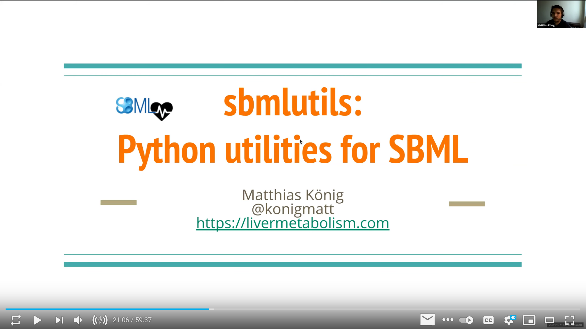

.. image:: https://github.com/matthiaskoenig/sbmlutils/raw/develop/docs_builder/images/sbmlutils-logo-60.png
   :align: left
   :alt: sbmlutils logo

sbmlutils: python utilities for SBML
====================================

.. image:: https://github.com/matthiaskoenig/sbmlutils/workflows/CI-CD/badge.svg
   :target: https://github.com/matthiaskoenig/sbmlutils/workflows/CI-CD
   :alt: GitHub Actions CI/CD Status

.. image:: https://img.shields.io/pypi/v/sbmlutils.svg
   :target: https://pypi.org/project/sbmlutils/
   :alt: Current PyPI Version

.. image:: https://img.shields.io/pypi/pyversions/sbmlutils.svg
   :target: https://pypi.org/project/sbmlutils/
   :alt: Supported Python Versions

.. image:: https://img.shields.io/pypi/l/sbmlutils.svg
   :target: http://opensource.org/licenses/LGPL-3.0
   :alt: GNU Lesser General Public License 3

.. image:: https://codecov.io/gh/matthiaskoenig/sbmlutils/branch/develop/graph/badge.svg
   :target: https://codecov.io/gh/matthiaskoenig/sbmlutils
   :alt: Codecov

.. image:: https://readthedocs.org/projects/sbmlutils/badge/?version=latest
   :target: https://sbmlutils.readthedocs.io/en/latest/?badge=latest
   :alt: Documentation Status

.. image:: https://zenodo.org/badge/55952847.svg
   :target: https://zenodo.org/badge/latestdoi/55952847
   :alt: Zenodo DOI

.. image:: https://img.shields.io/badge/code%20style-black-000000.svg
   :target: https://github.com/ambv/black
   :alt: Black

.. image:: http://www.mypy-lang.org/static/mypy_badge.svg
   :target: http://mypy-lang.org/
   :alt: mypy

sbmlutils is a collection of python utilities for working with
`SBML <http://www.sbml.org>`__ models implemented on top of
`libsbml <http://sbml.org/Software/libSBML>`__ and other libraries
with source code available from `https://github.com/matthiaskoenig/sbmlutils <https://github.com/matthiaskoenig/sbmlutils>`__.

Features include among others

-  helper functions for model creation, manipulation, and annotation
-  HTML reports of SBML models `https://sbml4humans.de <https://sbml4humans.de>`__.
-  interpolation functions to add experimental data to models
-  file converters (XPP)

The documentation is available on `https://sbmlutils.readthedocs.io <https://sbmlutils.readthedocs.io>`__. 
If you have any questions or issues please `open an issue <https://github.com/matthiaskoenig/sbmlutils/issues>`__.

How to cite
===========
.. image:: https://zenodo.org/badge/55952847.svg
   :target: https://zenodo.org/badge/latestdoi/55952847
   :alt: Zenodo DOI

Contributing
============

Contributions are always welcome! Please read the `contributing guidelines
<https://github.com/matthiaskoenig/sbmlutils/blob/develop/.github/CONTRIBUTING.rst>`__ to
get started.

License
=======

* Source Code: `LGPLv3 <http://opensource.org/licenses/LGPL-3.0>`__
* Documentation: `CC BY-SA 4.0 <http://creativecommons.org/licenses/by-sa/4.0/>`__

The sbmlutils source is released under both the GPL and LGPL licenses version 2 or
later. You may choose which license you choose to use the software under.

This program is free software: you can redistribute it and/or modify it under
the terms of the GNU General Public License or the GNU Lesser General Public
License as published by the Free Software Foundation, either version 2 of the
License, or (at your option) any later version.

This program is distributed in the hope that it will be useful, but WITHOUT ANY
WARRANTY; without even the implied warranty of MERCHANTABILITY or FITNESS FOR A
PARTICULAR PURPOSE. See the GNU General Public License for more details.

Funding
=======
Matthias König is supported by the Federal Ministry of Education and Research (BMBF, Germany)
within the research network Systems Medicine of the Liver (**LiSyM**, grant number 031L0054) 
and by the German Research Foundation (DFG) within the Research Unit Programme FOR 5151 
"`QuaLiPerF <https://qualiperf.de>`__ (Quantifying Liver Perfusion-Function Relationship in Complex Resection - 
A Systems Medicine Approach)" by grant number 436883643 and by grant number 
465194077 (Priority Programme SPP 2311, Subproject SimLivA).
SBML4Humans was funded as part of `Google Summer of Code 2021 <https://summerofcode.withgoogle.com/>`__.
Matthias König has received funding from the EOSCsecretariat.eu which has received funding 
from the European Union's Horizon Programme call H2020-INFRAEOSC-05-2018-2019, grant Agreement number 831644.

Installation
============
`sbmlutils` is available from `pypi <https://pypi.python.org/pypi/sbmlutils>`__ and 
can be installed via:: 

    pip install sbmlutils

Requirements
------------
`tkinter` is required which can be installed on linux via::

    apt-get install python-tk
    apt-get install python3-tk

Please see the respective installation instructions for your operating system.

Develop version
---------------
The latest develop version can be installed via::

    pip install git+https://github.com/matthiaskoenig/sbmlutils.git@develop

Or via cloning the repository and installing via::

    git clone https://github.com/matthiaskoenig/sbmlutils.git
    cd sbmlutils
    pip install -e .

To install for development use::

    pip install -e .[development]

© 2017-2022 Matthias König
