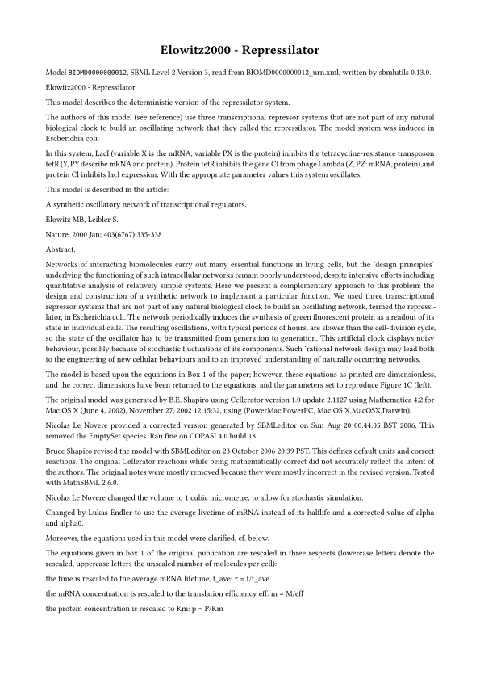
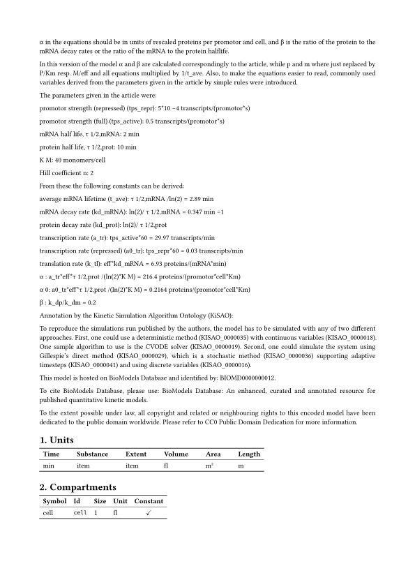
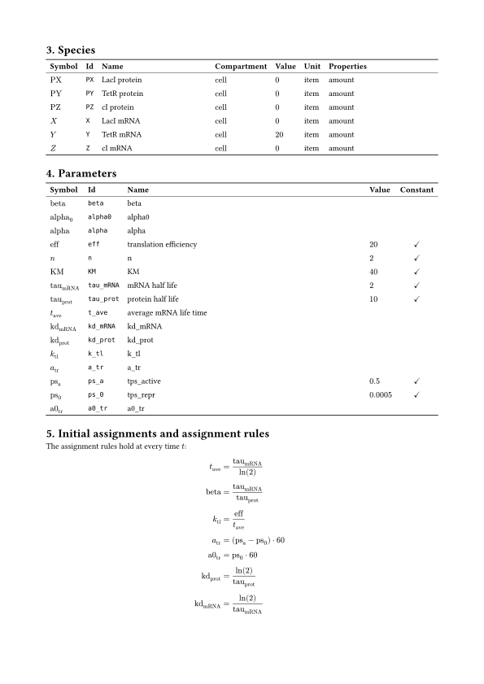
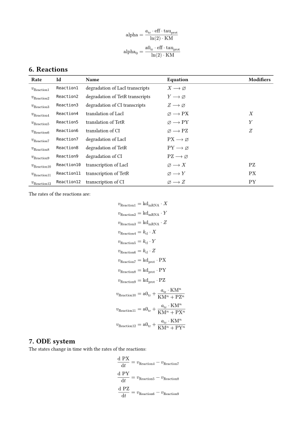

# ODE export

An SBML model describes a system of ordinary differential equations (ODEs), but it is not written as one: the equations follow from the reactions, rules, events and units of the model. `sbmlutils.converters.ode` derives this system once and writes it in six formats:

- **numerical formats**, code which simulates the model: **python** (numpy and a `scipy.integrate` solver), **julia** (OrdinaryDiffEq.jl of DifferentialEquations.jl) and **R** (deSolve);
- **presentation formats**, documents which describe the model: **typst**, **LaTeX** and **markdown**.

The numerical code is correct, it reproduces [libroadrunner](https://libroadrunner.org) over the [SBML test suite](https://github.com/sbmlteam/sbml-test-suite) (see [Verification](#verification)), and it is readable: the equations are written as the model states them, one per line with the name and unit of the variable as a comment. The three documents show the same content in the same order, so a model reads the same in each of them.

All formats share one analysis of the model and one math printer engine:

1. the **analysis** (`OdeSystem.from_sbml`) resolves the semantics of SBML into the ODE system: the state variables, the constants, the assignments in the order of their dependencies, the right hand side of every state, the initial values and the events;
2. the **printers** write the math of the model in a target language, one dialect per language, on the libsbml AST, so that the structure of an equation stays as it was written;
3. the **formats** render the system with a jinja2 template per format, which only lays out the text and the math the printers wrote.

## Quick start

```python
from sbmlutils.converters.ode import OdeSystem

system = OdeSystem.from_sbml("model.xml")

code: str = system.render("python")  # the code or document as a string
system.write("model.py")  # the format from the suffix of the file
system.write("model.typ", standalone=False)  # with the options of the format
```

`OdeSystem.from_sbml` takes the path of an SBML file, an SBML string or a `libsbml.SBMLDocument`, which is not changed. A model of the comp package is flattened first and a model of level 1 or 2 is read as level 3 version 2. The analysis raises a `ValueError` for a model which is not well defined, e.g. assignment rules whose dependencies form a cycle.

`write` takes the format from the suffix of the file, or from its argument `fmt`, and returns the path:

| format | name | suffix | kind | options |
| --- | --- | --- | --- | --- |
| python | `python` | `.py` | code | `simulator` |
| julia | `julia` | `.jl` | code | `simulator` |
| R | `r` | `.R`, `.r` | code | `simulator` |
| typst | `typst` | `.typ` | document | `standalone`, `symbols` |
| LaTeX | `latex` | `.tex` | document | `standalone`, `symbols` |
| markdown | `markdown` | `.md` | document | `standalone`, `symbols` |

The options are passed as keyword arguments to `render` and `write`; an option the format does not take, or a value of the wrong type, raises a `ValueError`:

| option | default | effect |
| --- | --- | --- |
| `simulator` | `True` | python, julia, R: `True` writes a self contained simulator, `simulate(t_end)` included; `False` writes the right hand side, the initial values, the assigned values and the events only, for a solver of your own. |
| `standalone` | `True` | typst, LaTeX, markdown: `True` writes a document which compiles on its own; `False` a fragment to include into a document of your own, see [Presentation formats](#presentation-formats). |
| `symbols` | `"id"` | typst, LaTeX, markdown: `"id"` typesets every element with its id, `"name"` with its name if the name is a valid symbol, see [Symbols and names](#symbols-and-names). |

`FORMATS` holds the formats by their name, each a `Format` with its template, suffixes, kind and options. The API is described in the [API reference](api/converters.ode.md).

`examples/converters/ode.py` writes all six formats of the repressilator (BIOMD0000000012, packaged as `sbmlutils.resources.REPRESSILATOR_SBML`), compiles the typst document and simulates the model with the python code:

```bash
python -m examples.converters.ode
```

The outputs on this page are written by this example.

## Supported SBML

The analysis follows the semantics of SBML level 3 version 2 as libroadrunner implements them. Every construct which the ODE system cannot express is collected in `OdeSystem.unsupported` as `(construct, element id)`, never dropped in silence: a numerical format raises a `NotImplementedError` which lists them, a document lists them in a section of its own.

| construct | numerical formats | presentation formats |
| --- | :---: | :---: |
| compartments, species, parameters | ✓ | ✓ |
| species in amount (`hasOnlySubstanceUnits`) and in concentration | ✓ | ✓ |
| boundary and constant species | ✓ | ✓ |
| conversion factors of a species and of the model | ✓ | ✓ |
| reactions, reversible and irreversible, modifiers | ✓ | ✓ |
| local parameters of a kinetic law | ✓ | ✓ |
| stoichiometry set by a rule, an initial assignment or an event | ✓ | ✓ |
| function definitions | ✓ | ✓ |
| initial assignments | ✓ | ✓ |
| assignment rules | ✓ | ✓ |
| rate rules on species, compartments, parameters and species references | ✓ | ✓ |
| compartments whose size changes (rate rule, assignment rule, event) | ✓ | ✓ |
| events: trigger, `initialValue`, `persistent`, delay, priority, `useValuesFromTriggerTime` | ✓ | ✓ |
| `rateOf` of a state or a constant | ✓ | ✓ |
| math: `piecewise`, relations, logic, `rem`, `quotient`, `log` with base, `root` with degree, `factorial`, trigonometric and hyperbolic functions, `time`, `avogadro`, `INF`, `NaN` | ✓ | ✓ |
| comp package | flattened | flattened |
| algebraic rules | unsupported | listed |
| `delay()` | unsupported | listed |
| fast reactions | unsupported | listed |
| distrib functions, e.g. `normal(mean, sd)` | unsupported | listed |
| `rateOf` of an assigned variable or of an expression | unsupported | listed |
| an event trigger without a continuous root function | unsupported | listed |

The fbc and layout packages describe no dynamics; their content is not part of the ODE system.

The analysis resolves the following semantics once, so that every format only prints what the system holds:

- **States** are the species which are neither constant nor boundary nor set by an assignment rule and take part in a reaction, and every compartment, species, parameter and species reference with a rate rule. Every other quantity is a constant or an assigned value; a constant which an event changes is constant between the events.
- **Species** are held as libroadrunner holds them: in amount if `hasOnlySubstanceUnits`, else in concentration, whose reaction terms are divided by the size of the compartment. A species in concentration in a compartment whose size changes is integrated as its amount `n_S`, the quantity SBML conserves when the size changes, with the concentration `S = n_S / V` as an assignment. A rate rule applies to a species as written.
- **Conversion factors**: the conversion factor of a species, else that of the model, multiplies its reaction terms.
- **Local parameters** are renamed to `<reaction id>_<parameter id>`, unique against all ids of the model, and are constant parameters of the system.
- **Assignments**, i.e. the assignment rules and the rates of the reactions, are evaluated in the order of their dependencies, ties in the order of the document; a cycle raises a `ValueError` naming the variables.
- **Initial values** at $t = 0$ evaluate the initial values, the initial assignments and the assignment rules in one order of their dependencies, so that an initial assignment which depends on a rule is right, and the reverse.
- **Defaults** as in libroadrunner: a compartment without a size has the size 1, a stoichiometry which is not set is 1, a reaction without a kinetic law has the rate 0.

## Numerical formats

The python, julia and R code have the same structure. Python counts from 0, julia and R from 1; the code unpacks the vectors into named variables, so the equations never show an index.

1. A header with the id and name of the model, the file it was read from, the version of sbmlutils, the units of the model and the table of the states.
2. The ids of the states `XIDS`, the constants `PIDS` and the assigned values `YIDS`, one per line with name and unit as a comment, and their names and units in `NAMES` and `UNITS`.
3. `P0`, the default values of the constants: the constant parameters, compartments and species.
4. `initial_values(p)`, which returns the initial states `x0` and the constants `p`, in which the constants set by an initial assignment are updated.
5. The right hand side, which unpacks the states and the constants, evaluates the function definitions, the assignments and the rates of the reactions in their order and returns the rate of change of every state, one line per state. `f_y` returns the assigned values and the rates of the reactions.
6. The events, see [Events](#events).
7. `simulate(t_end)` (only `simulator=True`), which integrates the model from $t = 0$ to `t_end`, executes the events and returns a table of the time, the states and the assigned values at `points` time points (101 by default).

The arguments follow the convention of the solvers of each language:

| | python | julia | R |
| --- | --- | --- | --- |
| initial values | `initial_values(p)`, a tuple `(x0, p)` | `initial_values(p)`, a tuple `(x0, p)` | `initial_values(p)`, a list of `x0` and `p` |
| right hand side | `f_dxdt(t, x, p)`, an array | `f!(dx, x, p, t)`, in place | `f_dxdt(t, x, p)`, `list(dx)` as deSolve wants it |
| assigned values | `f_y(t, x, p)` | `f_y(x, p, t)` | `f_y(t, x, p)` |
| simulation | `simulate(t_end)`, a pandas `DataFrame` | `simulate(t_end)`, a `DataFrame` of DataFrames.jl | `simulate(t_end)`, a `data.frame` |
| solver | a `scipy.integrate` `OdeSolver`, `LSODA` by default | `Rodas5P()` of OrdinaryDiffEq | `deSolve::lsoda` |
| dependencies | numpy, pandas, scipy | OrdinaryDiffEq, DataFrames, NaNMath (SpecialFunctions if the math uses `factorial`) | base R, deSolve for `simulate` |

`simulate` integrates with a relative tolerance of `1e-8` and an absolute tolerance of `1e-10` by default, with a largest step of the distance of two time points, and limits the number of steps of the solver: a model which grows without bound raises an error instead of running for ever. Every function evaluates the assignments it needs itself, so it can be read, and changed, on its own; the code has no classes, only constants and functions.

### Python

The python code needs numpy and pandas, which sbmlutils installs, and scipy for `simulate`, which the `examples` extra installs (`pip install "sbmlutils[examples]"`). Run as a script, the file prints the first rows of a simulation:

```bash
python repressilator.py
```

```python
import runpy

model = runpy.run_path("repressilator.py")
result = model["simulate"](t_end=1000.0, points=201)  # a pandas DataFrame
```

`simulate(t_end, points=101, p=None, x0=None, rtol=1e-8, atol=1e-10, method="LSODA", max_step=None, max_steps=None)` steps a solver of `scipy.integrate` (`method` is the name of its class, e.g. `"BDF"` or `"Radau"`), finds the change of an event trigger by bisection on the dense output of a step, and raises a `RuntimeError` if the integration fails, takes more than `max_steps` steps or makes a step too small to advance the time.

With `simulator=False`, or to use another solver, the right hand side has the signature of `scipy.integrate.solve_ivp`:

```python
import scipy.integrate
from repressilator import f_dxdt, initial_values

x0, p = initial_values()
solution = scipy.integrate.solve_ivp(
    f_dxdt, (0.0, 1000.0), x0, args=(p,), method="LSODA", rtol=1e-8, atol=1e-10
)
```

<!-- the snippet is no python, ruff formats the python blocks of markdown -->
<!-- fmt: off -->

??? example "`repressilator.py`, the python code of the repressilator"

    ```python
    --8<-- "images/ode/repressilator.py"
    ```

<!-- fmt: on -->

### Julia

The julia code is a module named after the model which uses the packages OrdinaryDiffEq, DataFrames and NaNMath (`NaNMath.pow` is `NaN` where `^` throws a `DomainError`, as SBML wants it), and SpecialFunctions if the math of the model needs the gamma function. Install them once:

```bash
julia -e 'using Pkg; Pkg.add(["OrdinaryDiffEq", "DataFrames", "NaNMath"])'
```

The module is included and used by its name, the id of the model:

```bash
julia -e 'include("repressilator.jl"); using .BIOMD0000000012
          println(first(simulate(1000.0), 5))'
```

`simulate(t_end; points=101, p=nothing, x0=nothing, reltol=1e-8, abstol=1e-10, alg=Rodas5P(), dtmax=nothing, max_steps=nothing)` steps an integrator of OrdinaryDiffEq (`alg` is any of its algorithms, e.g. `FBDF()`) and finds the events with a `VectorContinuousCallback`. The right hand side `f!(dx, x, p, t)` is an `ODEProblem` as it is:

```julia
include("repressilator.jl")
using .BIOMD0000000012
using OrdinaryDiffEq

x0, p = initial_values()
problem = ODEProblem(f!, x0, (0.0, 1000.0), p)
solution = solve(problem, Rodas5P(); reltol=1e-8, abstol=1e-10)
```

??? example "`repressilator.jl`, the julia code of the repressilator"

    ```julia
    --8<-- "images/ode/repressilator.jl"
    ```

### R

The R code needs base R only, and the package deSolve for `simulate` (`install.packages("deSolve")`). Run as a script, the file prints the first rows of a simulation:

```bash
Rscript repressilator.R
Rscript -e 'source("repressilator.R"); print(head(simulate(1000)))'
```

`simulate(t_end, points = 101, p = NULL, x0 = NULL, rtol = 1e-8, atol = 1e-10, hmax = NULL, max_steps = NULL)` integrates with `deSolve::lsoda` from event to event, with the root function of the triggers. The right hand side `f_dxdt(t, x, p)` is a `func` of deSolve:

```r
source("repressilator.R")
initial <- initial_values()
times <- seq(0, 1000, by = 10)
out <- deSolve::lsoda(initial$x0, times, f_dxdt, initial$p, rtol = 1e-8, atol = 1e-10)
```

The strings of the code are ASCII only, a character which is not ASCII is written as its escape `\u{e4}`, so the file reads the same in every locale.

??? example "`repressilator.R`, the R code of the repressilator"

    ```r
    --8<-- "images/ode/repressilator.R"
    ```

### Events

Events are supported in full by the three languages, with the semantics of SBML and libroadrunner, and are written whether or not the code is a simulator. The functions of the events take the arguments of the right hand side, `(t, x, p)` in python and R and `(x, p, t)` in julia, and an assignment the values in addition, `(t, x, p, values)` in python and R and `(x, p, t, values)` in julia:

- `event_triggers(t, x, p)` returns one continuous root function per event, whose sign is the truth value of its trigger: `a > b` is `a - b`, a conjunction the minimum and a disjunction the maximum of the root functions of its operands, a negation the negative. A solver ends its step where one of them changes its sign.
- `event_conditions(t, x, p)` returns the exact truth value of every trigger, which tells a strict relation from a non-strict one at the root.
- `event_values_<id>(t, x, p)` evaluates the values an event assigns, at the time of the trigger or of the execution as `useValuesFromTriggerTime` says, and `event_assign_<id>(t, x, p, values)` assigns them at the execution, with the conversion of a species in concentration whose compartment the event resizes.
- `EVENTS` lists every event with its flags `initial_value`, `persistent` and `use_trigger_values` and the functions of its delay, priority, values and assignments.

`simulate` evaluates the triggers at $t = 0$ with their `initialValue`, executes the events whose trigger turns true, orders simultaneous events by their priority, schedules delayed events, drops a non-persistent event whose trigger turned false before its execution, evaluates the assigned values anew after every execution and restarts the integration. A cascade of more than 10000 executions at one time raises an error, as in libroadrunner. Python, julia and R share this algorithm, so the three simulations agree.

## Presentation formats

The documents describe the model to a reader in the same sections, which are left out where the model has no content for them:

1. the title (the name of the model, else its id), a line with the id, the level and version of SBML, the file and the version of sbmlutils, and the notes of the model as text;
2. the units of the model;
3. the compartments, species and parameters as tables with symbol, id, name, value, unit and the constant flag; the species add compartment, amount or concentration, boundary condition;
4. the function definitions, `f(x, y) = ...`;
5. the initial assignments and the assignment rules, in the order of their evaluation;
6. the reactions as a table with the rate symbol, id, name, reaction equation (`⇌` if reversible) and modifiers, and the equations of their rates;
7. the ODE system, `dx/dt` of every state written with the rates of the reactions, `v_1 - 2 v_2`, the volumes and conversion factors explicit, a rate rule marked as such;
8. the events with trigger, delay, priority, flags and assignments;
9. the unsupported constructs.

A long sum is broken into lines of four terms. The math is typeset as in a textbook, not as in code: a quotient is a fraction, every sum is written with the signs of its terms (`a - b` rather than `a + (-1) b`), a number with a power of ten (`1.5 × 10⁻⁵`), a `piecewise` as cases and a condition used as a number as an Iverson bracket, `[A > 1]`.

`standalone=True` (the default) writes a document which compiles on its own, with the settings of its page and a title; `standalone=False` writes a fragment to include into a document of your own, whose title is a heading (`=` in typst, `\section` in LaTeX, `##` in markdown) with the sections one level below it.

### Typst

The typst document compiles with [typst](https://typst.app), or the `typst` python package:

```bash
typst compile repressilator.typ
```

The fragment of `standalone=False` holds the content in a block of its own, so its rules apply within it only, and is included with `#include "repressilator.typ"`. The pages of the repressilator (click a page for its full size):

<div class="doc-pages" markdown>

[{ loading=lazy width="595" height="842" }](images/ode/repressilator-1.svg)

[{ loading=lazy width="595" height="842" }](images/ode/repressilator-2.svg)

[{ loading=lazy width="595" height="842" }](images/ode/repressilator-3.svg)

[{ loading=lazy width="595" height="842" }](images/ode/repressilator-4.svg)

[{ loading=lazy width="595" height="842" }](images/ode/repressilator-5.svg)

</div>

??? example "`repressilator.typ`, the typst source of the repressilator"

    ```typst
    --8<-- "images/ode/repressilator.typ"
    ```

### LaTeX

The LaTeX document is an `article` with `amsmath`, `amssymb`, `booktabs`, `xltabular`, `parskip` and `hyperref`, which compiles with pdfLaTeX, XeLaTeX, LuaLaTeX or [tectonic](https://tectonic-typesetting.github.io):

```bash
tectonic repressilator.tex
```

The fragment of `standalone=False` is the body of the document, whose title is a `\section`, and is included with `\input{repressilator.tex}` into a document which loads `amsmath`, `amssymb`, `booktabs` and `xltabular`; a comment at its top names them.

??? example "`repressilator.tex`, the LaTeX source of the repressilator"

    ```latex
    --8<-- "images/ode/repressilator.tex"
    ```

### Markdown

The markdown is GitHub flavored markdown, with tables and the math as LaTeX in `$...$` and `$$...$$`, which GitHub renders, as does this documentation with MathJax (`pymdownx.arithmatex`). It is the markdown which `create_model(..., create_markdown=True)` writes next to the SBML file, see [Model creation](creation.md).

??? example "`repressilator.md`, the markdown source of the repressilator"

    ```markdown
    --8<-- "images/ode/repressilator.md"
    ```

The fragment of `standalone=False` is included at the [end of this page](#elowitz2000-repressilator), rendered.

## Symbols and names

In the documents an id is typeset as a math symbol: the part before the first underscore is the base, the rest the subscript, so `k_cat_glc` is $k_{\mathrm{cat\_glc}}$. An id of letters followed by digits has the digits as subscript, `k1` is $k_{1}$. A base of one letter is italic, a base of more letters is upright, `Glc` is $\mathrm{Glc}$. A base which is the name of a Greek letter is the letter, `tau_mRNA` is $\tau_{\mathrm{mRNA}}$, `alpha0` is $\alpha_{0}$ and `Gamma` is $\Gamma$; omicron is the Latin $o$, and an upper case letter which is a Latin one (`Alpha`) stays its name. Two ids are never typeset as the same symbol: of `k1` and `k_1` the first one is upright text, $\mathrm{k1}$, and of `omicron` and `o` the first one is its name, $\mathrm{omicron}$. The rate of a reaction is $v$ with the id of the reaction as subscript, $v_{\mathrm{J0}}$, the amount of a species which is integrated as an amount is $n$ with the symbol of the species as subscript, $n_{S}$. With `symbols="name"` an element is typeset with its name if the name is a valid symbol (letters, digits and underscores, starting with a letter), else with its id.

In the code every id is the name of its variable, except where the id is a keyword of the language, a builtin or a name the code uses itself (`t`, `x`, `p`, `np`, ...): such an id gets an underscore appended, so `lambda` is `lambda_` in python and `function` is `function_` in julia and R. Local parameters are named `<reaction id>_<parameter id>`.

## Safety

The export writes code which is run, so a model must not be able to inject code into it, and documents which are compiled, so a model must not be able to inject markup:

- every name, unit and note is written on a single line, so a line break in the name of an element cannot leave the comment it is written into, and is escaped for the strings of its language where it is written into a string (`NAMES`, the docstring);
- every id written into code or math is checked to be an SId, letters, digits and underscores, not starting with a digit; libsbml reads a document with an invalid id and only reports an error, the export raises a `ValueError`;
- every text of a document is escaped for its markup, so a name like `*bold*` or `$x$` is written as it is and never read as markup.

`tests/converters/ode/test_ode_safety.py` places such text and ids into every element of a model and checks, in every format, that none of it becomes code or markup: the code parses into the same program, the documents compile and show the text as it is.

## Custom templates

`render_template` renders the system with a jinja2 template of your own, with the context of a format, i.e. its names and its math printer. A template `odes.txt.jinja` which lists the ODEs,

```jinja

d{{ ode.id }}/dt = {{ ode.expr }}

```

renders the repressilator with the context of julia, `system.render_template("odes.txt.jinja", fmt="julia")`, as

```text
dPX/dt = Reaction4 - Reaction7
dPY/dt = Reaction5 - Reaction8
dPZ/dt = Reaction6 - Reaction9
dX/dt = -Reaction1 + Reaction10
dY/dt = -Reaction2 + Reaction11
dZ/dt = -Reaction3 + Reaction12
```

The template can include the templates of the formats (`sbmlutils/resources/converters/ode`), and has the filters of their languages: `single_line`, `python_string`, `docstring`, `julia_text`, `julia_string`, `r_text` and `r_string`. The context holds plain strings, numbers, lists and dictionaries, never libsbml objects. The context of a code format (`python`, `julia`, `r`) holds:

| key | content |
| --- | --- |
| `model` | id, name, level, version, source, units, the version of sbmlutils and `module`, the name of the julia module |
| `states`, `constants`, `assigned` | the variables of the vectors x, p and y, each with `id`, `name`, `unit`, `code` (the name in the code), `index`, `value`, `comment` and `kind` |
| `functions` | the function definitions with `code`, `arguments` and `body` |
| `initial`, `assignments` | the initial values at $t = 0$ and the assignments in the order of their evaluation, each with `id`, `code`, `expr` (the math in the language), `comment` and `origin` |
| `odes` | the right hand side of every state with `id`, `code`, `index`, `expr` and `comment` |
| `events` | every event with its trigger, root function, flags, delay, priority and assignments |
| `scopes` | for every function of the code the states, constants and assignments it uses |
| `options` | the options of the rendering |

The context of a document (`typst`, `latex`, `markdown`) holds `model`, `units`, `compartments`, `species`, `parameters`, `functions`, `initial`, `assignments`, `reactions`, `odes`, `events`, `unsupported` and `options`, every text escaped and every math typeset for its markup. The keys are described in full in the docstrings of `sbmlutils.converters.ode.formats` and `sbmlutils.converters.ode.documents`.

## Migration from odefac

`sbmlutils.converters.ode` replaces `sbmlutils.converters.odefac`, which is removed together with its templates and `sbmlutils.converters.mathml.evaluableMathML`:

| odefac (0.13) | ode |
| --- | --- |
| `SBML2ODE.from_file(path)` | `OdeSystem.from_sbml(path)` |
| `SBML2ODE(doc)` | `OdeSystem.from_sbml(doc)` |
| `to_python(path)` | `write(path)` or `render("python")` |
| `to_R`, `to_julia`, `to_markdown`, `to_tex` | `render("r")`, `render("julia")`, `render("markdown")`, `render("latex")`, or `write` with the suffix |
| `to_custom_template(template, output_file)` | `render_template(template)`, which returns the string, and `Path(output_file).write_text(...)` |

The generated python code changes in the same way:

| odefac (0.13) | ode |
| --- | --- |
| `xids`, `pids`, `yids` | `XIDS`, `PIDS`, `YIDS` |
| `x0`, `p` | `x0, p = initial_values(P0)`, which evaluates the initial assignments |
| `f_dxdt(x, t, p)`, the argument order of `odeint` | `f_dxdt(t, x, p)`, that of `solve_ivp` and the `OdeSolver` classes |
| `f_y(x, t, p)` | `f_y(t, x, p)` |
| `f_z(X, T, p)` | `simulate(t_end)`, which returns the time, the states and the assigned values |

A custom template of `odefac` has to be rewritten for the new context, see [Custom templates](#custom-templates): the names of its keys, the math in the printer of the format and the order of the arguments differ.

The new export supports initial assignments, local parameters, function definitions, `rateOf`, events and every construct of the [table above](#supported-sbml), which `odefac` did not, and `create_model(..., create_markdown=True)` writes the new markdown.

## Verification

The numerical formats are verified against libroadrunner on every case of the SBML semantic test suite (version 3.4.0, the models in level 3 version 2): the generated code simulates the case from $t = 0$ to $10$ at 51 time points, and every column of its table, i.e. the states, the assigned values and the constants which events change, agrees with libroadrunner at every time point with a relative tolerance of `1e-6` and an absolute tolerance of `1e-9`, relaxed to `1e-4` and `1e-6` for a model with events, whose event times are located to the tolerance of the integration. Of the 1690 cases, the pass rate is that of the cases which the export supports and libroadrunner simulates, `passed / (passed + failed)`:

<div class="doc-compact" markdown>

| format | passed | failed | unsupported | no reference | not deterministic | pass rate |
| --- | ---: | ---: | ---: | ---: | ---: | ---: |
| python | 1480 | 1 | 158 | 37 | 14 | 99.9 % |
| julia | 1480 | 1 | 158 | 37 | 14 | 99.9 % |
| R | 1479 | 2 | 158 | 37 | 14 | 99.9 % |

</div>

- **unsupported**: 158 cases use an algebraic rule (109) or `delay()` (51), some both.
- **no reference**: libroadrunner does not simulate the case: 34 cases of the fbc package, two which fail with `CV_TOO_CLOSE` (01754, 01758) and one with `CV_TOO_MUCH_WORK` (01148).
- **not deterministic**: 14 cases in which events with the same priority, or none, trigger at once, whose order of execution is random.
- **failed**: case 01511 in every format: its trigger holds for 0.025 time units between two steps of the integrator of libroadrunner, which misses the event, while the generated code finds and executes it. Case 01106 in R only: `deSolve::lsoda` integrates `X(1)` to one unit in the last place below 2, so the event is executed at 1.0000000000000002 and the time point 1 still has the values before it.

A curated subset of 67 cases, which covers every construct of SBML core, runs in the default test run for python and in the tox environments `julia` and `R` for julia and R. The tests of the formats in addition compare `initial_values`, `f_dxdt` and `f_y` of the packaged models and of a set of rate laws, which covers every construct of the math, with libroadrunner at $t = 0$ and at further states, with a relative tolerance of `1e-8`. The documents are verified by compiling them: the typst documents with the `typst` package in the default test run, the LaTeX documents with tectonic in the tox environment `latex`, the markdown by parsing it with markdown-it.

`scripts/ode_report.py` runs the sweep, every case in a process of its own, and prints this table:

```bash
python scripts/ode_report.py                               # python
python scripts/ode_report.py --format julia --format r     # julia and R
```

<div class="doc-rendered" markdown>

--8<-- "images/ode/repressilator_fragment.md"

</div>
