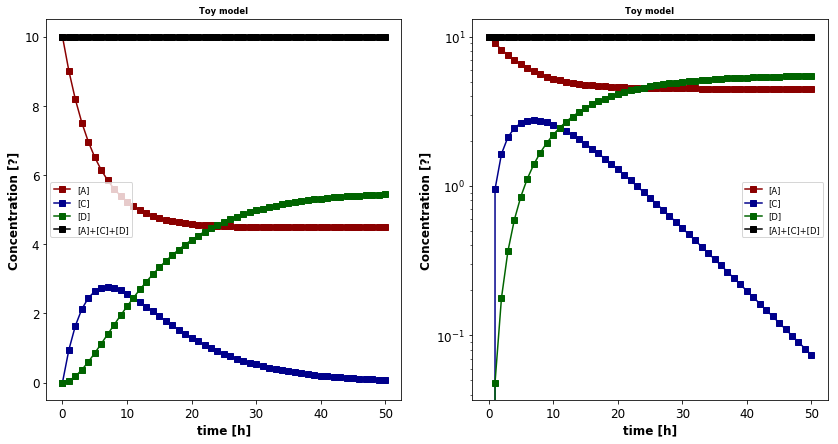
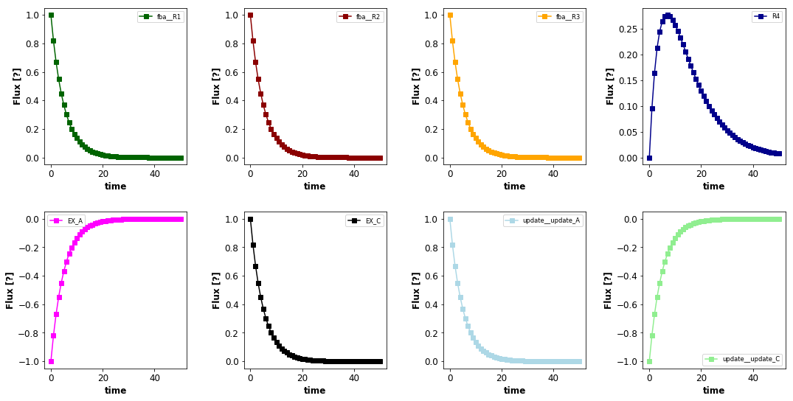

DFBA
====

This section describes how to run dynamic FBA (DFBA) with ``sbmlutils``.

.. code:: ipython3

    %matplotlib inline

.. code:: ipython3

    import os
    import sbmlutils
    from sbmlutils import dfba
    from sbmlutils.dfba import utils

Simulate DFBA model
-------------------

To run an existing DFBA model call use ``simulate_dfba``.

.. code:: ipython3

    # get the absolute path to the top model
    from sbmlutils.dfba.toy_wholecell import settings as toysettings
    from sbmlutils.dfba.toy_wholecell import model_factory as toyfactory
    from sbmlutils.dfba.toy_wholecell import simulate as toysimulate
    
    sbml_path = os.path.join(utils.versioned_directory(toysettings.OUT_DIR, toysettings.VERSION), 
                             toysettings.TOP_LOCATION)
    print(sbml_path)
    
    # run simulation with the top model
    from sbmlutils.dfba.simulator import simulate_dfba
    df, dfba_model, dfba_simulator = simulate_dfba(sbml_path, tend=50, dt=5.0)
    df

.. parsed-literal::

    WARNING:cobra.io.sbml:SBML package 'comp' not supported by cobrapy,information is not parsed
    INFO:root:--------------------------------------------------------------------------------
    <Model toy_wholecell_top "toy_wholecell (TOP)"> [ode]
    --------------------------------------------------------------------------------
    ode        : [<Submodel bounds>, <Submodel update>]
    fba        : [<Submodel fba>]
    dt         : 0.1
    flux rules :
    	      EX_A <-> pEX_A
    	      EX_C <-> pEX_C
    
    <Submodel fba> toy_wholecell_fba.xml
    --------------------------------------------------------------------------------
    	obj. direction        : maximize
    	cobra obj. direction  : max
    	fba2top reactions     : {'EX_C': 'EX_C', 'EX_A': 'EX_A'}
    	ub_pid2rid            : {'ub_EX_C': 'EX_C', 'ub_EX_A': 'EX_A', 'ub_R1': 'R1'}
    	lb_pid2rid            : {'lb_EX_C': 'EX_C', 'lb_EX_A': 'EX_A'}
    	top2flat reactions    : {'EX_C': 'EX_C', 'R2': 'fba__R2', 'R3': 'fba__R3', 'R1': 'fba__R1', 'EX_A': 'EX_A'}
    --------------------------------------------------------------------------------
    
    INFO:root:        lb    ub reversibility boundary objective_coefficient  \
    R1       0     1         False    False                     0   
    R2       0  1000         False    False                     0   
    R3       0  1000         False    False                     1   
    EX_A -1000  1000          True     True                     0   
    EX_C -1000  1000          True     True                     0   
    
             forward_variable                   reverse_variable  
    R1         0 <= R1 <= 1.0      0 <= R1_reverse_cda52 <= -0.0  
    R2      0 <= R2 <= 1000.0      0 <= R2_reverse_8c6d2 <= -0.0  
    R3      0 <= R3 <= 1000.0      0 <= R3_reverse_5c108 <= -0.0  
    EX_A  0 <= EX_A <= 1000.0  0 <= EX_A_reverse_b86fb <= 1000.0  
    EX_C  0 <= EX_C <= 1000.0  0 <= EX_C_reverse_69b38 <= 1000.0  
    INFO:root:dt set from old value <0.1> to new value: dt=5.0
    INFO:root:	lower: lb_EX_C    = 0.0 set to 0.0

.. parsed-literal::

    /home/mkoenig/git/sbmlutils/sbmlutils/dfba/toy_wholecell/results/v15/toy_wholecell_top.xml
    --------------------------------------------------------------------------------
    ODE integrator settings
    --------------------------------------------------------------------------------
    <roadrunner.RoadRunner() { 
    'this' : 0x660bd00
    'modelLoaded' : true
    'modelName' : toy_wholecell (TOP)
    'libSBMLVersion' : LibSBML Version: 5.17.2
    'jacobianStepSize' : 1e-05
    'conservedMoietyAnalysis' : false
    'simulateOptions' : 
    < roadrunner.SimulateOptions() 
    { 
    'this' : 0x658f6b0, 
    'reset' : 0,
    'structuredResult' : 0,
    'copyResult' : 1,
    'steps' : 50,
    'start' : 0,
    'duration' : 5
    }>, 
    'integrator' : 
    < roadrunner.Integrator() >
      name: cvode
      settings:
          relative_tolerance: 0.000001
          absolute_tolerance: 0.000001
                       stiff: true
           maximum_bdf_order: 5
         maximum_adams_order: 12
           maximum_num_steps: 20000
           maximum_time_step: 0
           minimum_time_step: 0
           initial_time_step: 0
              multiple_steps: false
          variable_step_size: false
    
    }>
    --------------------------------------------------------------------------------
    
    Simulation time     : 3.765 [s]
    Total time          : 3.847 [s]
    Overhead time       : 0.082 [s] (2.1 %)
    

.. raw:: html

    

    
    <table border="1" class="dataframe">
      <thead>
        <tr style="text-align: right;">
          <th></th>
          <th>time</th>
          <th>[A]</th>
          <th>[C]</th>
          <th>[D]</th>
          <th>[dummy_S]</th>
          <th>[fba__A]</th>
          <th>[fba__B1]</th>
          <th>[fba__B2]</th>
          <th>[fba__C]</th>
          <th>EX_A</th>
          <th>...</th>
          <th>fba__ub_default</th>
          <th>fba__zero</th>
          <th>k_R4</th>
          <th>lb_EX_A</th>
          <th>lb_EX_C</th>
          <th>pEX_A</th>
          <th>pEX_C</th>
          <th>ub_EX_A</th>
          <th>ub_EX_C</th>
          <th>ub_R1</th>
        </tr>
      </thead>
      <tbody>
        <tr>
          <th>0.0</th>
          <td>0.0</td>
          <td>10.000000</td>
          <td>0.000000</td>
          <td>0.000000</td>
          <td>0.0</td>
          <td>0.0</td>
          <td>0.0</td>
          <td>0.0</td>
          <td>0.0</td>
          <td>-1.000000</td>
          <td>...</td>
          <td>1000.0</td>
          <td>0.0</td>
          <td>0.1</td>
          <td>-100.000000</td>
          <td>0.000000</td>
          <td>-1.000000</td>
          <td>1.000000</td>
          <td>1000.0</td>
          <td>1000.0</td>
          <td>1.000000</td>
        </tr>
        <tr>
          <th>5.0</th>
          <td>5.0</td>
          <td>5.000000</td>
          <td>3.934702</td>
          <td>1.065298</td>
          <td>0.0</td>
          <td>0.0</td>
          <td>0.0</td>
          <td>0.0</td>
          <td>0.0</td>
          <td>-0.367874</td>
          <td>...</td>
          <td>1000.0</td>
          <td>0.0</td>
          <td>0.1</td>
          <td>-50.000000</td>
          <td>-39.347018</td>
          <td>-0.367874</td>
          <td>0.367874</td>
          <td>1000.0</td>
          <td>1000.0</td>
          <td>0.367874</td>
        </tr>
        <tr>
          <th>10.0</th>
          <td>10.0</td>
          <td>3.160630</td>
          <td>3.833989</td>
          <td>3.005381</td>
          <td>0.0</td>
          <td>0.0</td>
          <td>0.0</td>
          <td>0.0</td>
          <td>0.0</td>
          <td>-0.135346</td>
          <td>...</td>
          <td>1000.0</td>
          <td>0.0</td>
          <td>0.1</td>
          <td>-31.606304</td>
          <td>-38.339893</td>
          <td>-0.135346</td>
          <td>0.135346</td>
          <td>1000.0</td>
          <td>1000.0</td>
          <td>0.135346</td>
        </tr>
        <tr>
          <th>15.0</th>
          <td>15.0</td>
          <td>2.483901</td>
          <td>2.857979</td>
          <td>4.658121</td>
          <td>0.0</td>
          <td>0.0</td>
          <td>0.0</td>
          <td>0.0</td>
          <td>0.0</td>
          <td>-0.049792</td>
          <td>...</td>
          <td>1000.0</td>
          <td>0.0</td>
          <td>0.1</td>
          <td>-24.839010</td>
          <td>-28.579785</td>
          <td>-0.049792</td>
          <td>0.049792</td>
          <td>1000.0</td>
          <td>1000.0</td>
          <td>0.049792</td>
        </tr>
        <tr>
          <th>20.0</th>
          <td>20.0</td>
          <td>2.234939</td>
          <td>1.929372</td>
          <td>5.835689</td>
          <td>0.0</td>
          <td>0.0</td>
          <td>0.0</td>
          <td>0.0</td>
          <td>0.0</td>
          <td>-0.018318</td>
          <td>...</td>
          <td>1000.0</td>
          <td>0.0</td>
          <td>0.1</td>
          <td>-22.349392</td>
          <td>-19.293716</td>
          <td>-0.018318</td>
          <td>0.018318</td>
          <td>1000.0</td>
          <td>1000.0</td>
          <td>0.018318</td>
        </tr>
        <tr>
          <th>25.0</th>
          <td>25.0</td>
          <td>2.143347</td>
          <td>1.242302</td>
          <td>6.614351</td>
          <td>0.0</td>
          <td>0.0</td>
          <td>0.0</td>
          <td>0.0</td>
          <td>0.0</td>
          <td>-0.006739</td>
          <td>...</td>
          <td>1000.0</td>
          <td>0.0</td>
          <td>0.1</td>
          <td>-21.433472</td>
          <td>-12.423016</td>
          <td>-0.006739</td>
          <td>0.006739</td>
          <td>1000.0</td>
          <td>1000.0</td>
          <td>0.006739</td>
        </tr>
        <tr>
          <th>30.0</th>
          <td>30.0</td>
          <td>2.109651</td>
          <td>0.780016</td>
          <td>7.110334</td>
          <td>0.0</td>
          <td>0.0</td>
          <td>0.0</td>
          <td>0.0</td>
          <td>0.0</td>
          <td>-0.002480</td>
          <td>...</td>
          <td>1000.0</td>
          <td>0.0</td>
          <td>0.1</td>
          <td>-21.096505</td>
          <td>-7.800162</td>
          <td>-0.002480</td>
          <td>0.002480</td>
          <td>1000.0</td>
          <td>1000.0</td>
          <td>0.002480</td>
        </tr>
        <tr>
          <th>35.0</th>
          <td>35.0</td>
          <td>2.097252</td>
          <td>0.482855</td>
          <td>7.419893</td>
          <td>0.0</td>
          <td>0.0</td>
          <td>0.0</td>
          <td>0.0</td>
          <td>0.0</td>
          <td>-0.000912</td>
          <td>...</td>
          <td>1000.0</td>
          <td>0.0</td>
          <td>0.1</td>
          <td>-20.972519</td>
          <td>-4.828550</td>
          <td>-0.000912</td>
          <td>0.000912</td>
          <td>1000.0</td>
          <td>1000.0</td>
          <td>0.000912</td>
        </tr>
        <tr>
          <th>40.0</th>
          <td>40.0</td>
          <td>2.092691</td>
          <td>0.296460</td>
          <td>7.610849</td>
          <td>0.0</td>
          <td>0.0</td>
          <td>0.0</td>
          <td>0.0</td>
          <td>0.0</td>
          <td>-0.000336</td>
          <td>...</td>
          <td>1000.0</td>
          <td>0.0</td>
          <td>0.1</td>
          <td>-20.926908</td>
          <td>-2.964599</td>
          <td>-0.000336</td>
          <td>0.000336</td>
          <td>1000.0</td>
          <td>1000.0</td>
          <td>0.000336</td>
        </tr>
        <tr>
          <th>45.0</th>
          <td>45.0</td>
          <td>2.091012</td>
          <td>0.181129</td>
          <td>7.727859</td>
          <td>0.0</td>
          <td>0.0</td>
          <td>0.0</td>
          <td>0.0</td>
          <td>0.0</td>
          <td>-0.000123</td>
          <td>...</td>
          <td>1000.0</td>
          <td>0.0</td>
          <td>0.1</td>
          <td>-20.910125</td>
          <td>-1.811288</td>
          <td>-0.000123</td>
          <td>0.000123</td>
          <td>1000.0</td>
          <td>1000.0</td>
          <td>0.000123</td>
        </tr>
        <tr>
          <th>50.0</th>
          <td>50.0</td>
          <td>2.090395</td>
          <td>0.110338</td>
          <td>7.799267</td>
          <td>0.0</td>
          <td>0.0</td>
          <td>0.0</td>
          <td>0.0</td>
          <td>0.0</td>
          <td>-0.000045</td>
          <td>...</td>
          <td>1000.0</td>
          <td>0.0</td>
          <td>0.1</td>
          <td>-20.903950</td>
          <td>-1.103377</td>
          <td>-0.000045</td>
          <td>0.000045</td>
          <td>1000.0</td>
          <td>1000.0</td>
          <td>0.000045</td>
        </tr>
      </tbody>
    </table>
    
11 rows × 30 columns

    

Toy example
-----------

.. code:: ipython3

    from sbmlutils.dfba.toy_wholecell import settings as toysettings
    from sbmlutils.dfba.toy_wholecell import model_factory as toyfactory
    from sbmlutils.dfba.toy_wholecell import simulate as toysimulate
    
    import tempfile
    test_dir = tempfile.mkdtemp()
    
    # create the toy model
    toyfactory.create_model(test_dir)
    # here the files are generated
    sbml_path = os.path.join(utils.versioned_directory(test_dir, toysettings.VERSION),
                             toysettings.TOP_LOCATION)
    print(sbml_path)
    # simulate
    dfs = toysimulate.simulate_toy(sbml_path, test_dir, dts=[1.0], figures=False)
    
    toysimulate.print_species(dfs=dfs)
    toysimulate.print_fluxes(dfs=dfs)
    print(dfs[0].head())

.. parsed-literal::

    Create directory: /tmp/tmpgr58razr/v15

.. parsed-literal::

    ERROR:root:Providing model units as dict is deprecated, use 'ModelUnits' instead.
    ERROR:root:Using notes strings is deprecated, use 'Notes' instead.
    INFO:root:
    ------------------------------------------------------------------------------------------------------------------------
    /tmp/tmpgr58razr/v15/toy_wholecell_fba.xml
    valid                    : TRUE
    check time (s)           : 0.009
    ------------------------------------------------------------------------------------------------------------------------
    ERROR:root:Providing model units as dict is deprecated, use 'ModelUnits' instead.
    ERROR:root:Using notes strings is deprecated, use 'Notes' instead.
    INFO:root:
    ------------------------------------------------------------------------------------------------------------------------
    /tmp/tmpgr58razr/v15/toy_wholecell_bounds.xml
    valid                    : TRUE
    check time (s)           : 0.012
    ------------------------------------------------------------------------------------------------------------------------
    ERROR:root:Providing model units as dict is deprecated, use 'ModelUnits' instead.
    ERROR:root:Using notes strings is deprecated, use 'Notes' instead.
    INFO:root:
    ------------------------------------------------------------------------------------------------------------------------
    /tmp/tmpgr58razr/v15/toy_wholecell_update.xml
    valid                    : TRUE
    check time (s)           : 0.006
    ------------------------------------------------------------------------------------------------------------------------
    ERROR:root:Providing model units as dict is deprecated, use 'ModelUnits' instead.
    ERROR:root:Using notes strings is deprecated, use 'Notes' instead.
    INFO:root:
    ------------------------------------------------------------------------------------------------------------------------
    /tmp/tmpgr58razr/v15/toy_wholecell_top.xml
    valid                    : TRUE
    check time (s)           : 0.037
    ------------------------------------------------------------------------------------------------------------------------
    INFO:root:
    ------------------------------------------------------------------------------------------------------------------------
    <SBMLDocument>
    flattened                : TRUE
    flatten time (ms)        : 0.039
    ------------------------------------------------------------------------------------------------------------------------
    INFO:root:Flattened model written to /tmp/tmpgr58razr/v15/toy_wholecell_flattened.xml
    INFO:root:/tmp/tmpgr58razr/v15/toy_wholecell_fba.xml
    INFO:root:/tmp/tmpgr58razr/v15/toy_wholecell_bounds.xml
    INFO:root:/tmp/tmpgr58razr/v15/toy_wholecell_update.xml
    INFO:root:/tmp/tmpgr58razr/v15/toy_wholecell_top.xml
    INFO:root:/tmp/tmpgr58razr/v15/toy_wholecell_flattened.xml
    WARNING:cobra.io.sbml:SBML package 'comp' not supported by cobrapy,information is not parsed
    INFO:root:--------------------------------------------------------------------------------
    <Model toy_wholecell_top "toy_wholecell (TOP)"> [ode]
    --------------------------------------------------------------------------------
    ode        : [<Submodel bounds>, <Submodel update>]
    fba        : [<Submodel fba>]
    dt         : 0.1
    flux rules :
    	      EX_A <-> pEX_A
    	      EX_C <-> pEX_C
    
    <Submodel fba> toy_wholecell_fba.xml
    --------------------------------------------------------------------------------
    	obj. direction        : maximize
    	cobra obj. direction  : max
    	fba2top reactions     : {'EX_C': 'EX_C', 'EX_A': 'EX_A'}
    	ub_pid2rid            : {'ub_EX_C': 'EX_C', 'ub_EX_A': 'EX_A', 'ub_R1': 'R1'}
    	lb_pid2rid            : {'lb_EX_C': 'EX_C', 'lb_EX_A': 'EX_A'}
    	top2flat reactions    : {'EX_C': 'EX_C', 'R2': 'fba__R2', 'R3': 'fba__R3', 'R1': 'fba__R1', 'EX_A': 'EX_A'}
    --------------------------------------------------------------------------------
    
    INFO:root:        lb    ub reversibility boundary objective_coefficient  \
    R1       0     1         False    False                     0   
    R2       0  1000         False    False                     0   
    R3       0  1000         False    False                     1   
    EX_A -1000  1000          True     True                     0   
    EX_C -1000  1000          True     True                     0   
    
             forward_variable                   reverse_variable  
    R1         0 <= R1 <= 1.0      0 <= R1_reverse_cda52 <= -0.0  
    R2      0 <= R2 <= 1000.0      0 <= R2_reverse_8c6d2 <= -0.0  
    R3      0 <= R3 <= 1000.0      0 <= R3_reverse_5c108 <= -0.0  
    EX_A  0 <= EX_A <= 1000.0  0 <= EX_A_reverse_b86fb <= 1000.0  
    EX_C  0 <= EX_C <= 1000.0  0 <= EX_C_reverse_69b38 <= 1000.0  
    INFO:root:dt set from old value <0.1> to new value: dt=1.0
    INFO:root:	lower: lb_EX_C    = 0.0 set to 0.0

.. parsed-literal::

    /tmp/tmpgr58razr/v15/dfba_simulation.xml
    /tmp/tmpgr58razr/v15/toy_wholecell_top.xml
    --------------------------------------------------------------------------------
    ODE integrator settings
    --------------------------------------------------------------------------------
    <roadrunner.RoadRunner() { 
    'this' : 0x74aede0
    'modelLoaded' : true
    'modelName' : toy_wholecell (TOP)
    'libSBMLVersion' : LibSBML Version: 5.17.2
    'jacobianStepSize' : 1e-05
    'conservedMoietyAnalysis' : false
    'simulateOptions' : 
    < roadrunner.SimulateOptions() 
    { 
    'this' : 0x7302c50, 
    'reset' : 0,
    'structuredResult' : 0,
    'copyResult' : 1,
    'steps' : 50,
    'start' : 0,
    'duration' : 5
    }>, 
    'integrator' : 
    < roadrunner.Integrator() >
      name: cvode
      settings:
          relative_tolerance: 0.000001
          absolute_tolerance: 0.000001
                       stiff: true
           maximum_bdf_order: 5
         maximum_adams_order: 12
           maximum_num_steps: 20000
           maximum_time_step: 0
           minimum_time_step: 0
           initial_time_step: 0
              multiple_steps: false
          variable_step_size: false
    
    }>
    --------------------------------------------------------------------------------
    
    Simulation time     : 17.780 [s]
    Total time          : 17.863 [s]
    Overhead time       : 0.083 [s] (0.5 %)
    
    * DFBA Solution is UNIQUE *

.. parsed-literal::

    INFO:root:print_species: None

.. parsed-literal::

    INFO:root:print_fluxes: None

.. parsed-literal::

         time        [A]       [C]       [D]  [dummy_S]  [fba__A]  [fba__B1]  \
    0.0   0.0  10.000000  0.000000  0.000000        0.0       0.0        0.0   
    1.0   1.0   9.000000  0.951639  0.048362        0.0       0.0        0.0   
    2.0   2.0   8.181278  1.640202  0.178520        0.0       0.0        0.0   
    3.0   3.0   7.510973  2.122005  0.367022        0.0       0.0        0.0   
    4.0   4.0   6.962185  2.442313  0.595502        0.0       0.0        0.0   
    
         [fba__B2]  [fba__C]      EX_A  ...  fba__ub_default  fba__zero  k_R4  \
    0.0        0.0       0.0 -1.000000  ...           1000.0        0.0   0.1   
    1.0        0.0       0.0 -0.818722  ...           1000.0        0.0   0.1   
    2.0        0.0       0.0 -0.670305  ...           1000.0        0.0   0.1   
    3.0        0.0       0.0 -0.548788  ...           1000.0        0.0   0.1   
    4.0        0.0       0.0 -0.449304  ...           1000.0        0.0   0.1   
    
            lb_EX_A    lb_EX_C     pEX_A     pEX_C  ub_EX_A  ub_EX_C     ub_R1  
    0.0 -100.000000   0.000000 -1.000000  1.000000   1000.0   1000.0  1.000000  
    1.0  -90.000000  -9.516386 -0.818722  0.818722   1000.0   1000.0  0.818722  
    2.0  -81.812784 -16.402019 -0.670305  0.670305   1000.0   1000.0  0.670305  
    3.0  -75.109734 -21.220050 -0.548788  0.548788   1000.0   1000.0  0.548788  
    4.0  -69.621850 -24.423134 -0.449304  0.449304   1000.0   1000.0  0.449304  
    
    [5 rows x 30 columns]

Diauxic growth
--------------

.. code:: ipython3

    '''
    from sbmlutils.dfba.diauxic_growth import settings as dgsettings
    from sbmlutils.dfba.diauxic_growth import model_factory as dgfactory
    from sbmlutils.dfba.diauxic_growth import simulate as dgsimulate
    from sbmlutils.dfba.diauxic_growth import analyse as dganalyse
    
    import tempfile
    test_dir = tempfile.mkdtemp()
    
    # create the model
    dgfactory.create_model(test_dir)
    
    # top model file
    sbml_path = os.path.join(utils.versioned_directory(test_dir, dgsettings.VERSION),
                             dgsettings.TOP_LOCATION)
    print(sbml_path)
    
    # run DFBA
    dfs = dgsimulate.simulate_diauxic_growth(sbml_path, test_dir, dts=[0.01], figures=False)
    
    # plot results
    dganalyse.print_species(dfs=dfs)
    dganalyse.print_fluxes(dfs=dfs)
    print(dfs[0].head())
    '''

.. parsed-literal::

    '\nfrom sbmlutils.dfba.diauxic_growth import settings as dgsettings\nfrom sbmlutils.dfba.diauxic_growth import model_factory as dgfactory\nfrom sbmlutils.dfba.diauxic_growth import simulate as dgsimulate\nfrom sbmlutils.dfba.diauxic_growth import analyse as dganalyse\n\nimport tempfile\ntest_dir = tempfile.mkdtemp()\n\n# create the model\ndgfactory.create_model(test_dir)\n\n# top model file\nsbml_path = os.path.join(utils.versioned_directory(test_dir, dgsettings.VERSION),\n                         dgsettings.TOP_LOCATION)\nprint(sbml_path)\n\n# run DFBA\ndfs = dgsimulate.simulate_diauxic_growth(sbml_path, test_dir, dts=[0.01], figures=False)\n\n# plot results\ndganalyse.print_species(dfs=dfs)\ndganalyse.print_fluxes(dfs=dfs)\nprint(dfs[0].head())\n'

