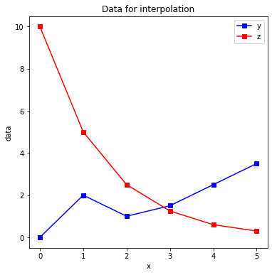
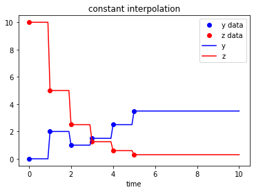
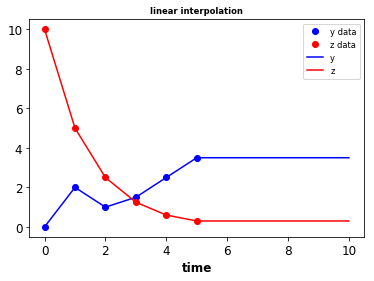
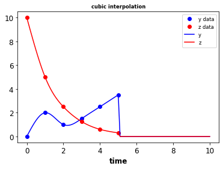

SBML interpolation
==================

``sbmlutils`` provides functionality for creating interpolated functions
in SBML models. This allows to drive the model with experimental data
sets.

Dataset
-------

In a first step an experimental data set is loaded as a ``pandas``
DataFrame.

.. code:: ipython3

    %matplotlib inline

.. code:: ipython3

    import pandas as pd
    from matplotlib import pyplot as plt
    
    # nicer plots
    from sbmlutils.dfba.analysis import set_matplotlib_parameters
    set_matplotlib_parameters()
    
    # load dataset
    data = pd.read_csv('./data/interpolation/data1.tsv', '\t')
    print(data)
    
    # plot data
    fig, ax = plt.subplots(nrows=1, ncols=1, figsize=(6, 6))
    ax.plot(data['x'], data['y'], '-s', label="y", color="blue")
    ax.plot(data['x'], data['z'], '-s', label="z", color="red")
    ax.set_title("Data for interpolation")
    ax.set_xlabel('x')
    ax.set_ylabel('data')
    
    ax.legend()
    plt.show()

.. parsed-literal::

         x    y      z
    0  0.0  0.0  10.00
    1  1.0  2.0   5.00
    2  2.0  1.0   2.50
    3  3.0  1.5   1.25
    4  4.0  2.5   0.60
    5  5.0  3.5   0.30

Interpolate data
----------------

Now we interpolate the experimental data with different methods and
write the resulting SBML models with the interpolation functions.

.. code:: ipython3

    # import the interpolation functionality
    from sbmlutils.interpolation import *
    import os
    if not os.path.exists('tmp'):
        os.mkdir('tmp')
    
    # constant interpolation
    ip_constant = Interpolation(data=data, method=INTERPOLATION_CONSTANT)
    ip_constant.write_sbml_to_file("./tmp/data1_constant.xml")
    
    # linear interpolation
    ip_linear = Interpolation(data=data, method=INTERPOLATION_LINEAR)
    ip_linear.write_sbml_to_file("./tmp/data1_linear.xml")
    
    # natural cubic spline
    ip_cubic = Interpolation(data=data, method=INTERPOLATION_CUBIC_SPLINE)
    ip_cubic.write_sbml_to_file("./tmp/data1_cubic.xml")

.. parsed-literal::

    
    --------------------------------------------------------------------------------
    /tmp/tmpmbjjuajo/validated.xml
    valid                    : TRUE
    check time (s)           : 0.003
    --------------------------------------------------------------------------------
    
    
    --------------------------------------------------------------------------------
    /tmp/tmpy_h7nonj/validated.xml
    valid                    : TRUE
    check time (s)           : 0.003
    --------------------------------------------------------------------------------
    
    
    --------------------------------------------------------------------------------
    /tmp/tmpbxjt_cfa/validated.xml
    valid                    : TRUE
    check time (s)           : 0.005
    --------------------------------------------------------------------------------
    

Simulate
--------

In the next step we can use the interpolation SBML models for
simulation.

.. code:: ipython3

    # simulate
    def plot_data(s, name):
        """ Helper function for plotting interpolation with data. """
        from matplotlib import pyplot as plt
        plt.plot(data['x'], data['y'], 'o', label="y data", color="blue")
        plt.plot(data['x'], data['z'], 'o', label="z data", color="red")
        plt.plot(s['time'], s['y'], '-', label="y", color="blue")
        plt.plot(s['time'], s['z'], '-', label="z", color="red")
        plt.xlabel('time')
        plt.title('{} interpolation'.format(name))
        plt.legend()
    
    import roadrunner
    for name in ['constant', 'linear', 'cubic']:
        sbml_file = './tmp/data1_{}.xml'.format(name)
        r = roadrunner.RoadRunner(sbml_file)
        
        # Simulate the interpolation
        r.timeCourseSelections = ['time', 'y', 'z']
        s = r.simulate(0,10,steps=100)
        # print(s)
    
        plot_data(s, name=name)
        plt.show()

Combine models
--------------

Combination of a fitted data model with a regular model via comp. In the
following example antimony is used to combine the splines with the
model.

.. code:: ipython3

    '''
    import antimony
    from sbmlutils.interpolation import Interpolation, INTERPOLATION_CUBIC_SPLINE
    
    ip = Interpolation(data=data, method=INTERPOLATION_CUBIC_SPLINE)
    sbml_str = ip.write_sbml_to_string()
    r = te.loads(sbml_str)
    a_spline = r.getAntimony()
    print(a_spline)
    '''

.. parsed-literal::

    '\nimport antimony\nfrom sbmlutils.interpolation import Interpolation, INTERPOLATION_CUBIC_SPLINE\n\nip = Interpolation(data=data, method=INTERPOLATION_CUBIC_SPLINE)\nsbml_str = ip.write_sbml_to_string()\nr = te.loads(sbml_str)\na_spline = r.getAntimony()\nprint(a_spline)\n'

.. code:: ipython3

    '''
    # combine the models with antimony
    a_test = a_spline + """
    model *test()
        // add spline submodel to the model
        A: Interpolation_cubic_spline();
        
        J0: S1 -> S2; k1*S1;
        J1: $S3 -> S2; k1*S3;
        J2: $S4 -> S2; k1*S4;
        S1 = 10.0; S2=0.0; S3=0.0; S4=0.0
        k1 = 0.3;
        
        // use the submodel info in model not working
        A.y is y;
        A.z is z;
        
        S3 := y
        S4 := z
    end
    """
    
    r2 = te.loada(a_test)
    print(r2.getAntimony())
    r2.timeCourseSelections = ['time'] + r2.getBoundarySpeciesIds() + r2.getFloatingSpeciesIds()
    print(r2.timeCourseSelections)
    
    s = r2.simulate(0, 10, 101)
    r2.plot(s)
    '''

.. parsed-literal::

    '\n# combine the models with antimony\na_test = a_spline + """\nmodel *test()\n    // add spline submodel to the model\n    A: Interpolation_cubic_spline();\n    \n    J0: S1 -> S2; k1*S1;\n    J1: $S3 -> S2; k1*S3;\n    J2: $S4 -> S2; k1*S4;\n    S1 = 10.0; S2=0.0; S3=0.0; S4=0.0\n    k1 = 0.3;\n    \n    // use the submodel info in model not working\n    A.y is y;\n    A.z is z;\n    \n    S3 := y\n    S4 := z\nend\n"""\n\nr2 = te.loada(a_test)\nprint(r2.getAntimony())\nr2.timeCourseSelections = [\'time\'] + r2.getBoundarySpeciesIds() + r2.getFloatingSpeciesIds()\nprint(r2.timeCourseSelections)\n\ns = r2.simulate(0, 10, 101)\nr2.plot(s)\n'

