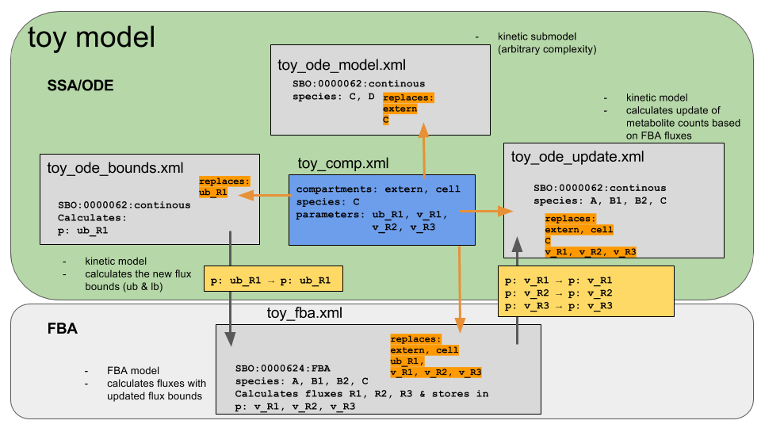

# Toy model
Simple toy model to demonstrate the coupling of SBML models with different modelling frameworks.

## Modelling framework
For the simulator to understand with which modelling framework submodels/models should be simulated it is
necessary to annotate the `<model>` element with the modelling framework. For the annotation the SBO terms below the
`SBO:0000004 - modelling framework` are used.

```
SBO:0000004 - modelling framework
|    SBO:0000062 continuous framework
|    SBO:0000063 discrete framework
|    SBO:0000624 flux balance framework
|    SBO:0000234 logical framework
```
In a first version the SBOTerm of the model is set. This is currently not legal, but the simplest approach.

When creating the comp models the model SBOTerms should be copied to the respective submodel sbase, i.e.
```
<comp:listOfSubmodels>
  <comp:submodel sboTerm="SBO:0000062" comp:id="bounds" comp:modelRef="toy_ode_bounds"/>
  <comp:submodel sboTerm="SBO:0000062" comp:id="update" comp:modelRef="toy_ode_update"/>
  <comp:submodel sboTerm="SBO:0000062" comp:id="model" comp:modelRef="toy_ode_model"/>
  <comp:submodel sboTerm="SBO:0000624" comp:id="fba" comp:modelRef="toy_fba"/>
</comp:listOfSubmodels>
```
The submodel SBOterms are used by the simulator to decide which simulation framework to use.

## Submodels



## Create models and simulate
The following content is available for the toy model
```
toymodel
|   settings.py: file names and destinations
|   model_factory.py: creates the individual submodels
|   comp_factory.py: creates the combined comp models
|   simulator.py: simulator for the comp model
|   run_all.py: script
|   models/: created models
|   docs/: documentation of models (reports)
|   results/: results of simulations
```

### Requirements
Build the following libraries with their python bindings from the latest source
* `libsbml`
* `roadrunner`
* `cobrapy`
* `sbmlutils` - python sbmlutils (package not yet on github)

### Create models & simulate
All models are created and the test simulation run via
```
python run_all.py
```
This performs an iterative simulation between FBA and ODE implemented in `simulator.py`


